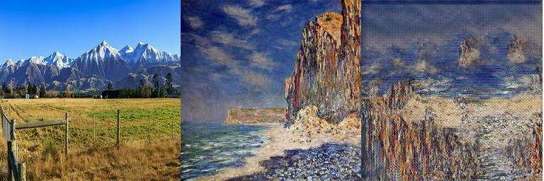

# Real Time Style Transfer

A program to train models for real-time style transfer. The models are based on the paper [Perceptual Losses for Real-Time Style Transfer and Super-Resolution](https://arxiv.org/abs/1603.08155) by Johnson et al. (2016).

## What is style transfer, why real-time
In style transfer we try to generate an image with a content in the style of a different image, see example. This can be achived by using a tailored loss function.

As opposed to [A Neural Algorithm of Artistic Style](https://arxiv.org/abs/1508.06576), Johnson et al. moved the learning of the style entirely into the training phase, which reduces the inference phase to a single forward pass. The model is trained with a *perceptual loss* instead of a pixel loss. Here, the output of the transformation network is passed into a pre-trained `VGG16` network. This network acts as the loss network since activations are extracted at different layers and summed up to a loss.

## Setup
To get started, add content images to the folder `data/content`. You can also change the content image path in the configuration file. Next, add style images to the `data/style` folder. For the `transformationNet` model the authors of the paper trained on the COCO dataset (~80,000 images) for $2$ epochs with a batchsize of $4$.

One style image is used for training.

The examples in this repository are made with the [kaggle](https://www.kaggle.com/c/gan-getting-started/data) art competition dataset.

## How to use
Three files are important if you want to generate images: `configuration.yaml`, `train.py`, and `run.py`. In the following the steps are explained.

### Train models
- Add images to the folder `data`. Content images and the selected style image are used by the model to learn weights. Currently, only `.jpg` images of the same size are supported.
- Check the settings in `configuration.yaml`. Whenever there is a conflict between information in the config and arguments, the argument is taken.
- Train the model by calling `train.py`. The trained models are saved in the folder `models`.

For each training, the model is saved in the path which is set in the `configuration.yaml` and the loss during training is written to a log file in the folder `models/<model_name>/<model_name>`.

Once training is complete you find model weights, the loss in a log file, and a plot of the loss in the folder `models/<model_name>/`.

You can continue with training from previous weights by providing the weights as argument. Then, epochs means the total epochs, including the ones already trained.

### Available models
Currently, four models are supported.

| Model name | Parameters total | Trainable parameters | Comment |
|-------|-------|-------|-------|
| TransformNet | 1,682,435 | 1,679,235 | From paper, deconvs | 
| TransformNetConvs | 1,682,435 | 1,679,235 | Bilinear upsampling with convs |
| MediumNet | 201,475 | 200,835 | Bilinear upsampling with convs |
| TinyNet | 53,059 | 52,803 | Bilinear upsampling with convs |

The first one `TransformNet` is an implementation of the model from the paper. However, it uses deconvolutions for upsampling and in tests on the kaggle dataset this model [lead](https://www.neuralception.com/convs-deconvs-artifacts/) to checkerboard artifacts. That is why the deconvolutions are replaced by bilinear upsampling and zero padding, followed by a direct convolution in `TransformNetConvs`. Additonally, there are two smaller networks, both of which use the same upsampling and convolution.

### Use trained models for style transfer
To use trained models for style transfer of content images, run `run.py`. You can either choose a specific model by its weights with the argument `--model`, or choose all models in a model folder with `--allModels`. The second required argument is the content image `--image` which has to be located in the content image path. Select the name without the file extension.

